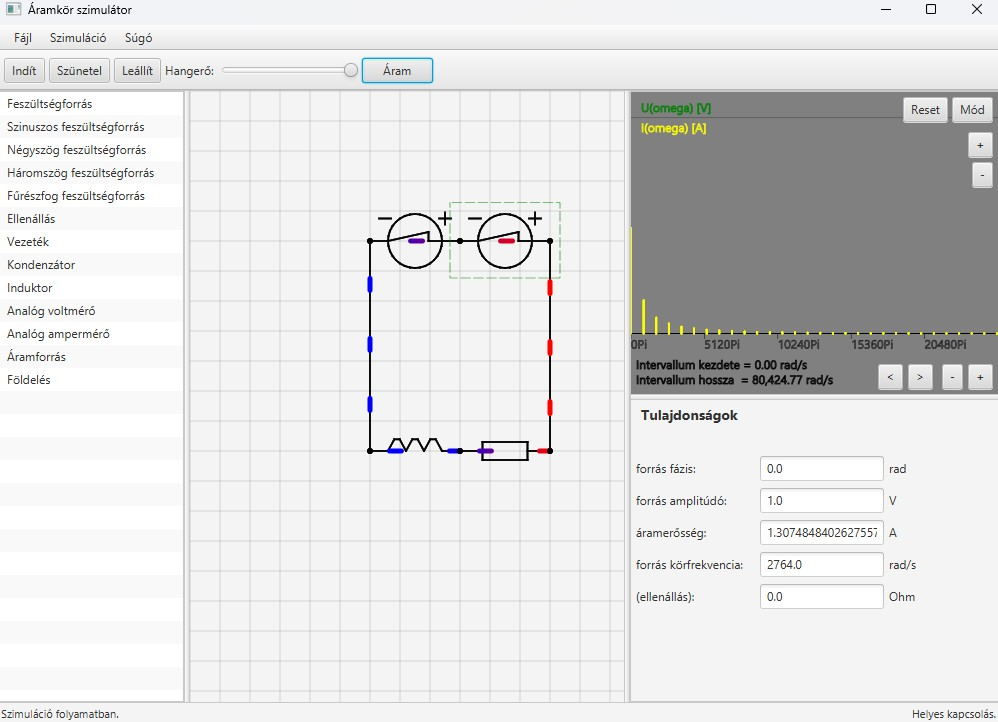

# Electrical network

An application for simulating simple electrical networks written in Java 23 using the [JavaFX](https://openjfx.io/) library.
The user can drag-and-drop various components onto the canvas, and the relevant parameters of the components
can be edited in the properties panel. The electric voltage and current values are displayed on a virtual oscilloscope display.
Here, the user can toggle between time-domain and frequency-domain representation.
The application generates audio output based on the signal in the selected component.
The visual representation of the components helps to understand the direction of current flow in the wiring and the voltage drop across components.

